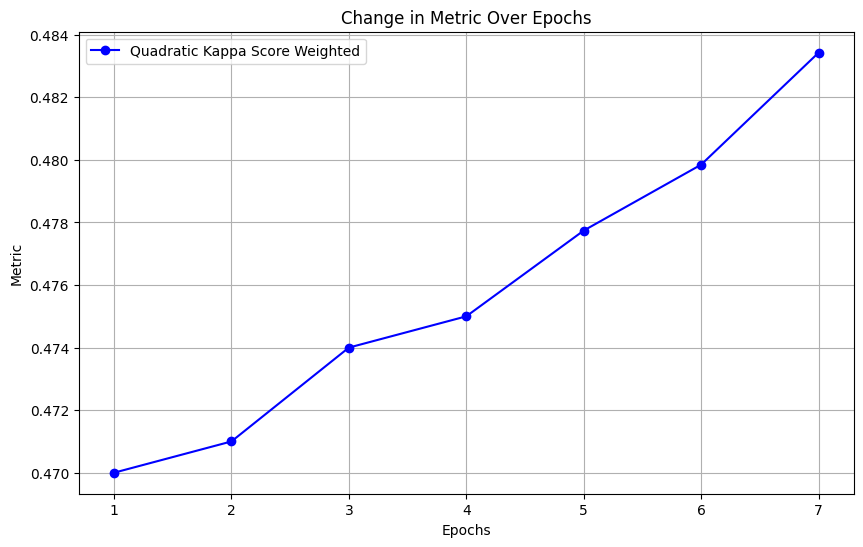

# ReLoRA: Paper Implementation and Experiments

## Project by:
- **Omar Zoloev**
- **Konstantin Zorin**
- **Alex Boriskin**
- **Ivan Lisitsyn**
- **Nikita Vakhrameev**

---

## Project Description

This repository contains the implementation and experiments for the ReLoRA paper.

paper: [ReLoRA: High-Rank Training Through Low-Rank Updates](https://arxiv.org/pdf/2307.05695)

## Source

- **Data:** `.../src/data`
  - Contains all the datasets used for the experiments.
  
- **Modules:** `.../src/modules`
  - Contains all the modules and scripts for the implementation of ReLoRA.

## Dataset and Metric

The dataset and metric used for this project were taken from a competition on Kaggle [Automated Essay Scoring 2.0](https://www.kaggle.com/competitions/learning-agency-lab-automated-essay-scoring-2/data)

### Metric

```python
import sklearn
from sklearn.metrics import cohen_kappa_score

def quadratic_weighted_kappa(y_pred, y_true):
    return cohen_kappa_score(
        y_true.astype(int),
        y_pred.clip(0, 5).round(0),
        weights='quadratic',
    )
```


## Results

| Metric / Optimizer                | AdamW 3 epoch | AdamW Without reset optimizer | Adagrad 7 epoch | AdamW reset optimizer ½ weights | AdamW reset optimizer ¼ weights |
|---------------------------------|---------------|-------------------------------|-----------------|-------------------------------|-------------------------------|
| **QWK**                         | 0.741         | 0.690                         | 0.721           | 0.716                         | 0.730                         |
| **MSE Loss per epoch**          | 0.500         | 0.601                         | 0.550           | 0.540                         | 0.531                         |




